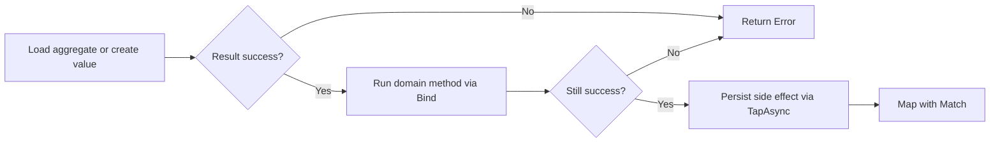
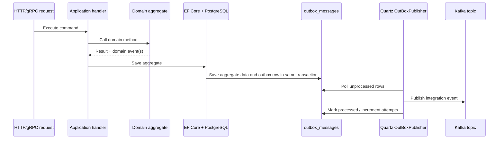
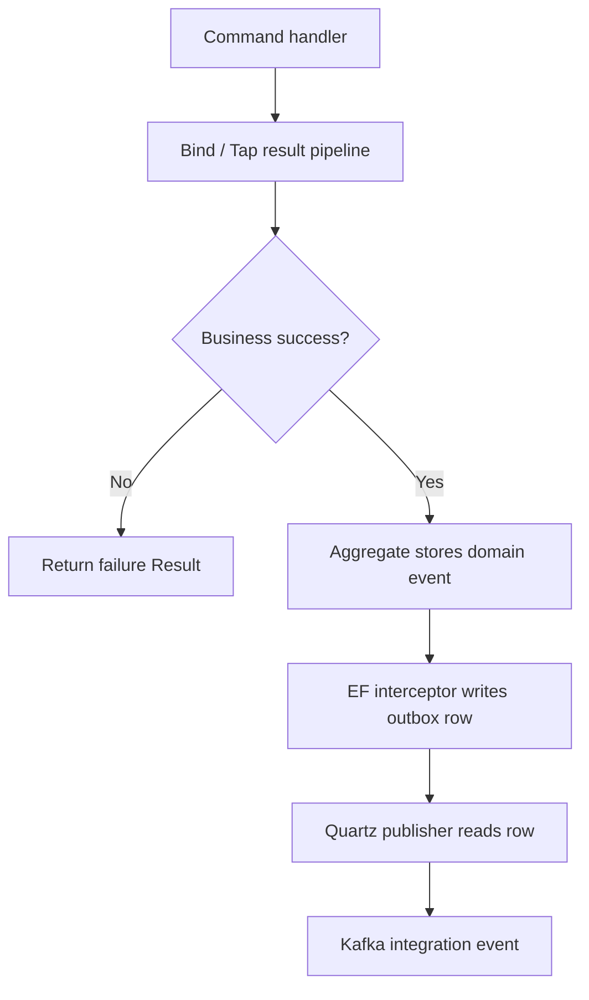

# ECommerceOS

ECommerceOS is a distributed eCommerce platform built with .NET 10, .NET Aspire, and a clean architecture split across independently deployable services. The repository uses Aspire to orchestrate local infrastructure, wire service discovery, and expose a gateway over the service mesh.

## What is in this repository

- `ECommerceOS.AppHost` provisions local infrastructure, starts the services, and exposes the gateway.
- `ECommerceOS.AuthService` owns user registration, login, refresh tokens, logout, email verification, and identity events.
- `ECommerceOS.CatalogService` owns products, categories, carts, checkout handoff, image uploads, and inventory reservation.
- `ECommerceOS.OrderService` owns order queries plus order-event publication and inventory reservation orchestration.
- `ECommerceOS.PaymentService` owns payment initialization, transaction sessions, Stripe integration, webhook handling, and payment events.
- `ECommerceOS.ServiceDefaults` centralizes health checks, service discovery, HTTP resilience, and OpenTelemetry.
- `ECommerceOS.Shared` contains shared contracts, DTOs, value objects, auth helpers, and protobuf definitions.

## Architecture summary

The solution follows a consistent service layout:

- `*.Application` contains use cases and request handling.
- `*.Domain` contains aggregates, entities, and domain rules.
- `*.Infrastructure` owns persistence, messaging, caching, background jobs, external integrations, and outbound clients.
- `*.Presentation` exposes HTTP or gRPC endpoints and exception handling.
- `*.WebApi` hosts the service and wires the layers together.
- `*.Tests` or `*.Domain.Tests` contain service-level tests.

Local orchestration is handled by Aspire:

- PostgreSQL hosts `identitydb`, `catalogdb`, `orderdb`, and `paymentdb`.
- Redis is provisioned for distributed caching and backplane support.
- Kafka and Schema Registry back integration events.
- Azure Storage emulator provides blob storage for catalog media.
- YARP exposes a single gateway endpoint.

## Service interactions

- `CatalogService` calls `PaymentService` through gRPC checkout contracts in `ECommerceOS.Shared/Contracts/ProtoBuf/Checkout.proto`.
- `OrderService` calls `CatalogService` through gRPC inventory reservation contracts in `ECommerceOS.Shared/Contracts/ProtoBuf/Reserve.proto`.
- Services publish and consume Kafka integration events on `catalog-event`, `payment-event`, `order-event`, and `identity-event`.
- Quartz-driven background jobs are used for outbox publishing in multiple services.

## Result and outbox patterns

This codebase uses a railroad-style result pattern, more commonly called railway-oriented programming, to keep application flows explicit. It is paired with the outbox pattern so state changes and cross-service messages are connected without publishing directly from request handlers.

### Railroad-style result flow

The shared `ECommerceOS.Shared.Result` package provides:

- `Result` and `Result<T>` to represent either success or failure.
- `Error` to carry a code, description, and category such as validation, not found, conflict, or failure.
- `Bind` and `BindAsync` to move to the next step only when the current step succeeded.
- `Tap` and `TapAsync` to run side effects such as persistence without breaking the pipeline.
- `Match` to convert the final result into a response DTO or an API error.

Typical handler flow in this repository:



Examples in the codebase:

- `AuthService` login chains user lookup, password verification, token generation, refresh-token attachment, and persistence in `LoginCommandHandler`.
- `CatalogService` category commands chain aggregate creation or mutation with repository writes.
- `OrderService` confirm and cancel commands chain aggregate loading, domain transitions, and updates, then let the outbox pick up any emitted domain events.

That gives the handlers a consistent shape:

- Domain rules return `Result` instead of throwing for expected business failures.
- Handlers short-circuit automatically when a step fails.
- API endpoints only need to translate the final `Result` into HTTP output, usually through `ToProblemDetails()`.

### Outbox flow

The outbox pattern is implemented in `AuthService`, `CatalogService`, `OrderService`, and `PaymentService`.

Each service follows the same structure:

- Aggregates inherit from `AggregateRoot<TId>` and collect `DomainEvents`.
- A save-changes interceptor reads those domain events before EF Core commits.
- The interceptor maps selected domain events into integration events and stores them in `outbox_messages`.
- A Quartz job named `OutBoxPublisher` runs every 10 seconds, reads unprocessed rows with `FOR UPDATE SKIP LOCKED`, publishes them to Kafka, and updates `processed_on`, `attempts`, and `error`.



The important constraint is that the handler does not publish directly to Kafka. It only commits business state. The infrastructure layer converts committed domain events into durable outbox records and publishes them later. That removes the classic failure window where the database commit succeeds but the message publish fails.

### How both patterns work together

The two patterns are deliberately connected:

1. A handler uses the result pipeline to decide whether a business operation is valid.
2. On success, the aggregate records domain events such as order creation or confirmation.
3. During `SaveChanges`, the interceptor serializes the corresponding integration event into `outbox_messages`.
4. The background publisher sends the event to Kafka after the database transaction has already succeeded.



One concrete example is the order flow:

- `Order.Create(...)` returns `Result<Order>` and adds `OrderCreatedDomainEvent`.
- `SubmitOrderCommandHandler` keeps building the aggregate and persists it only while each step succeeds.
- `DispatchDomainEventsInterceptor` in `OrderService.Infrastructure` converts `OrderCreatedDomainEvent`, `OrderConfirmedDomainEvent`, and `OrderCancelDomainEvent` into integration events such as `OrderSubmitted`, `OrderConfirmed`, and `OrderCancelled`.
- `OutBoxPublisher` reads those rows and publishes the serialized event envelope to Kafka.

This separation keeps business logic synchronous and explicit, while messaging remains durable and retryable.

## Local development

### Prerequisites

- .NET 10 SDK
- Docker Desktop or another container runtime supported by .NET Aspire
- HTTPS development certificate trusted locally
- Optional test credentials for Stripe, Google OAuth, and SMTP if you want to exercise those integrations end to end

### Start the full platform

```bash
dotnet restore ECommerceOS.slnx
dotnet run --project ECommerceOS.AppHost
```

The AppHost is the recommended entrypoint because it provisions and wires the infrastructure automatically.

### Useful local endpoints

- Gateway: `https://localhost:8001`
- PgAdmin: `http://localhost:5050`
- Azurite blob endpoint: `http://localhost:3100`
- Aspire dashboard: assigned by the AppHost launch profile at runtime

### Run a single service

Each service can be started independently with its `*.WebApi` project, but you must provide the infrastructure it depends on yourself.

```bash
dotnet run --project ECommerceOS.AuthService/ECommerceOS.AuthService.WebApi
dotnet run --project ECommerceOS.CatalogService/ECommerceOS.CatalogService.WebApi
dotnet run --project ECommerceOS.OrderService/ECommerceOS.OrderService.WebApi
dotnet run --project ECommerceOS.PaymentService/ECommerceOS.PaymentService.WebApi
```

## Configuration

Development defaults live in each service's `appsettings.Development.json`. The main configuration groups used across the solution are:

- `ConnectionStrings` for PostgreSQL, Kafka, Schema Registry, Redis, and blob storage
- `JwtOptions` for token issuance and validation
- `SmtpClientOptions` for outbound email
- `Authentication:Google` in `AuthService`
- `StripeWebhookOptions` in `PaymentService`
- `KeyOptions` in `AuthService` for encryption support

Prefer user secrets or environment variables for anything sensitive.

## API and gateway notes

- Each service exposes its own HTTP endpoints directly in Development.
- OpenAPI is enabled in Development for every `*.WebApi` host.
- Gateway routes are defined in `ECommerceOS.AppHost/AppHost.cs`.
- The Stripe webhook route is forwarded through the gateway at `/webhook`.

## Testing

Run the whole repository test surface:

```bash
dotnet test ECommerceOS.slnx
```

Run a single service test surface:

```bash
dotnet test ECommerceOS.AuthService/ECommerceOS.AuthService.slnx
dotnet test ECommerceOS.CatalogService/ECommerceOS.CatalogService.slnx
dotnet test ECommerceOS.OrderService/ECommerceOS.OrderService.slnx
dotnet test ECommerceOS.PaymentService/ECommerceOS.PaymentService.slnx
```

## Project guides

- [AppHost guide](ECommerceOS.AppHost/README.md)
- [Auth service guide](ECommerceOS.AuthService/README.md)
- [Catalog service guide](ECommerceOS.CatalogService/README.md)
- [Order service guide](ECommerceOS.OrderService/README.md)
- [Payment service guide](ECommerceOS.PaymentService/README.md)
- [Service defaults guide](ECommerceOS.ServiceDefaults/README.md)
- [Shared contracts guide](ECommerceOS.Shared/README.md)
